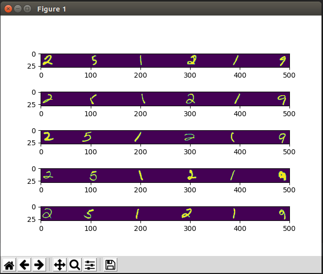

# Coding Project: MNIST digits sequence generator

[](#)
[](https://github.com/Jitesh17/digits-sequence-generator)
[](https://opensource.org/licenses/MIT)

## Table of Contents

[TOC]

This program generates images representing sequences of numbers. The images representing each digit is taken from the [MNIST database](http://yann.lecun.com/exdb/mnist/).

## Requirements
Please install the following before running the code.
* numpy
* matplotlib
## How to use the script
 
###  image_generator.py
In the terminal, write

```sh
$ python3 image_generator.py
```
- Then enter the parameters one by one when asked.
- All the data must be in integers.
- You may get suggetions on entering the wrong input.
```sh
Enter the sequence:
```
```sh
Enter gap range from:
```
```sh
Enter gap range to:
```
```sh
Enter image width:
```
```sh
Enter number of images to create (default is 1):
```
Finally the output image will be saved in the same directory with same name as the input sequence.

### example
To check the code without entering any parameters, the given command will generate 5 images of the number sequence '251219'.
```sh
$ python3 example.py
```
Output would be similar to the below image:


### API: generate_numbers_sequence()
API can be used as follows,
```python
import function as f
image = f.generate_numbers_sequence()
```

## Specifications

```python
def generate_numbers_sequence(digits, spacing_range, image_width, img_limit=1, show=False):
"""
Parameters
----------
digits: 
	A sequence of integers. Default value is set to '12345'.
spacing_range:
	A (minimum, maximum) pair (tuple), representing the min and max 
	spacing between digits. Default value is set to '(5, 50)'.
image_width:
	Specifies the width of the image in pixels. Default value is set to '500'.
img_limit:
	Specifies the number of different images you want to create. Default value is set to '1'.
show:
	If you want to see the images immediately. Default value is set to 'False'.


Returns
-------
The image containing the sequence of numbers. Images is represented
as floating point 32bits numpy arrays with a scale ranging from 0 (black) to
1 (white), the first dimension corresponding to the height and the second
dimension to the width.

If img_limit is 1, then the function returns single image.
Otherwise it returns a list of images.

"""
```

## Future improvements

Using [ImageDataGenerator](https://keras.io/preprocessing/image/) class from Keras, 
the MNIST data used currently can be processed and size of the data can be increased 
by data augmentation. 

## Appendix and FAQ

:::info
**Find this document incomplete?** Leave a comment!
:::
